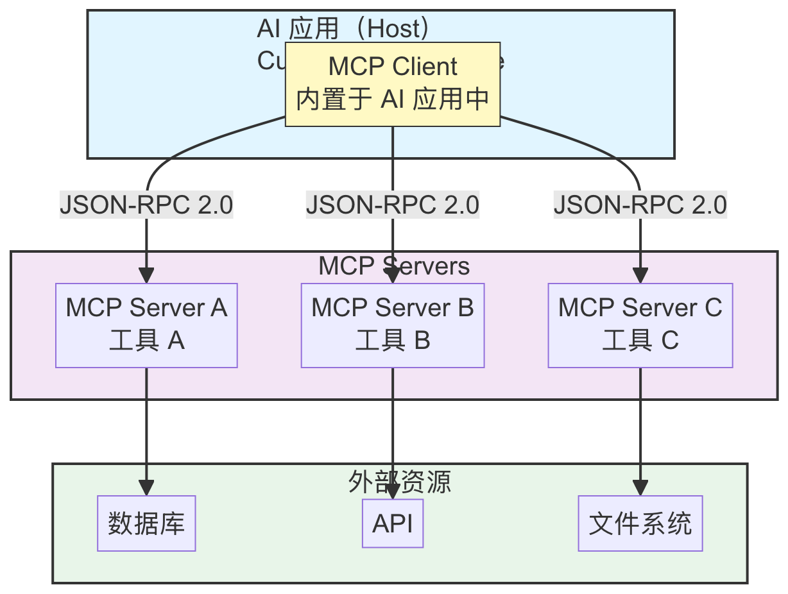
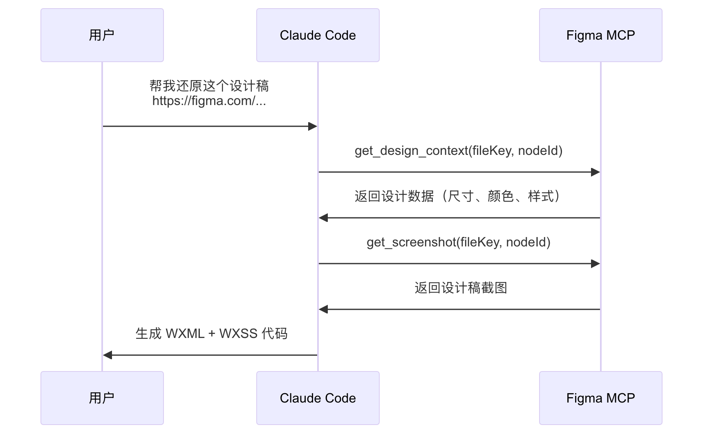
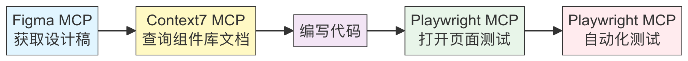
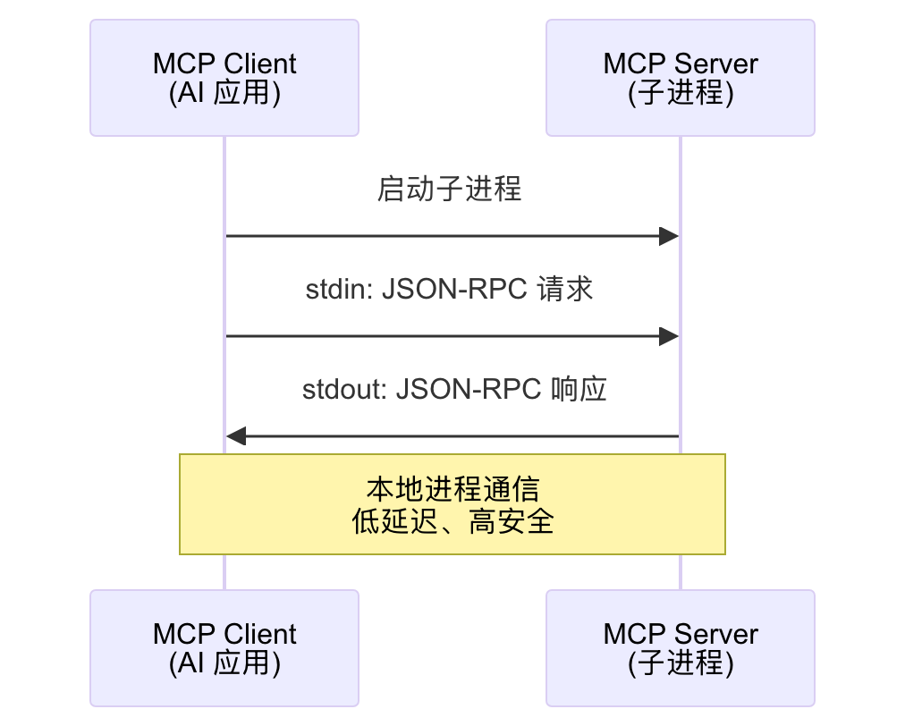
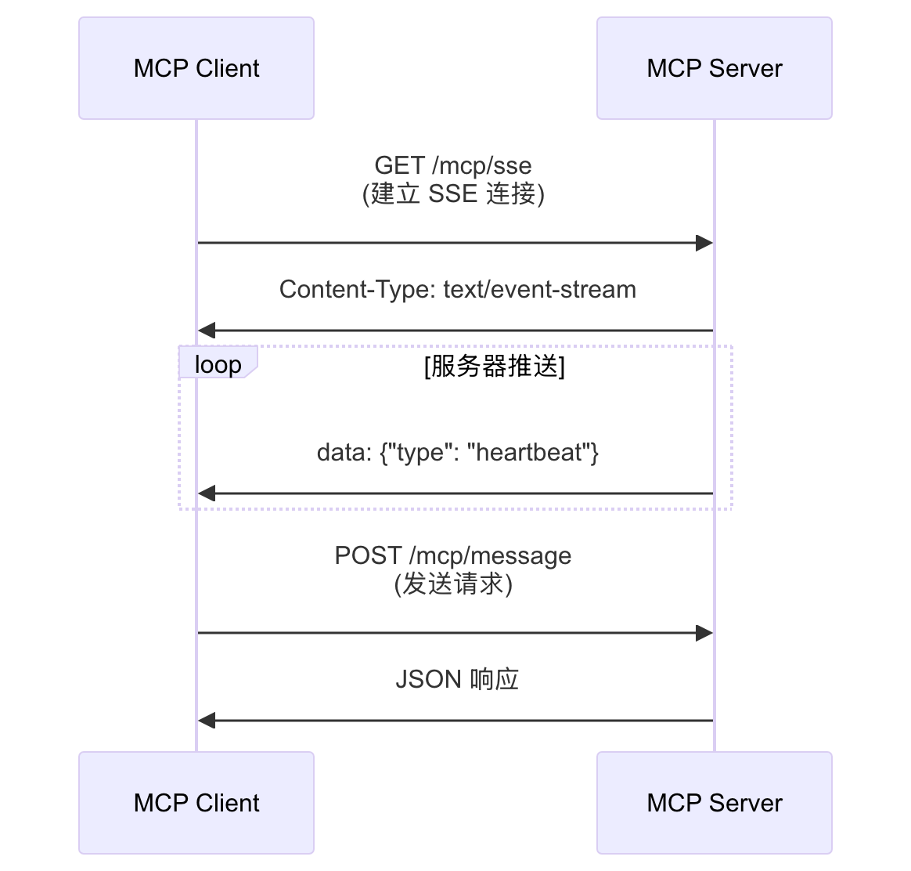
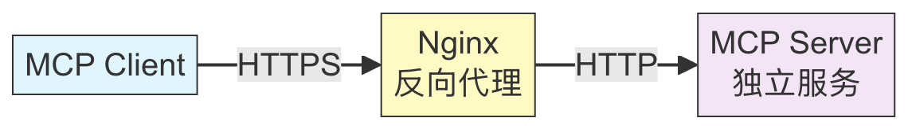
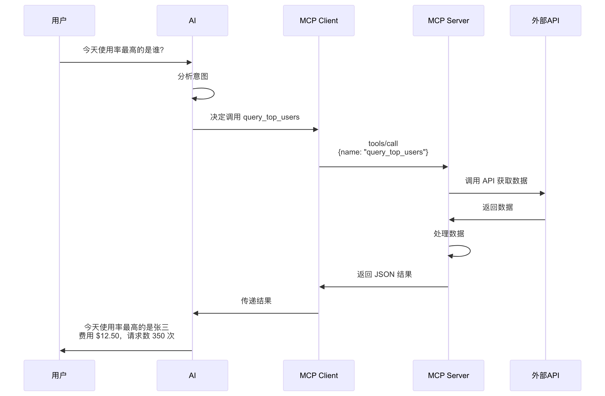
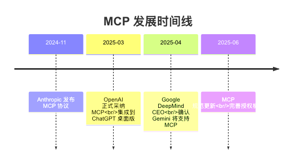

# MCP 开发入门与实战

> 📘 **适用于钉钉文档演讲版本** - 本文档已针对钉钉展示和演讲场景优化

---

## 一、什么是 MCP

大家好！在座的各位，有多少人用过 Cursor 或者 Claude Code 开发？

那有没有遇到过这样的情况：
- AI 帮你写代码，但不能直接读取 Figma 设计稿
- AI 很聪明，但不能帮你操作浏览器做测试
- AI 知识很丰富，但文档总是过时的

今天我要分享的 MCP，就是来解决这些问题的。简单说，它让 AI 从"只会说话"变成"会动手干活"。

---

### 1.1 没有 MCP 之前的痛点

在 MCP 出现之前，AI 工具的集成面临以下挑战：

**痛点 1：重复开发**
- 每个 AI 应用（Claude、ChatGPT、Gemini）都要单独对接每个工具
- 开发一次 Figma 插件，要为 3 个 AI 分别适配 3 次
- M×N 问题：M 个 AI × N 个工具 = M×N 次开发

**痛点 2：能力受限**
- AI 只能"说话"，不能"动手"
- 无法直接读取设计稿、操作浏览器、查询数据库
- 每次都要人工中转，效率低下

**痛点 3：知识过时**
- AI 训练数据有截止日期
- 无法获取最新的框架文档和 API 变更
- 生成的代码可能使用已废弃的方法

就像每个电器都有自己的专用插头，你需要准备一堆转接头才能用。

---

### 1.2 MCP 定义

**MCP（Model Context Protocol，模型上下文协议）** 是由 Anthropic 于 2024 年 11 月推出的开放协议，用于标准化 AI 应用程序与外部数据源、工具之间的集成方式。

MCP 就像是 AI 应用的 **"USB-C 接口"** 或 **"万能插头"**。

---

### 1.3 MCP 如何解决这些痛点

**痛点 1：无法读取 Figma 设计稿 → Figma MCP**
- 通过 Figma MCP，AI 可以直接读取设计稿的结构、样式、尺寸
- 自动生成符合设计规范的代码
- 无需手动测量、截图对照

**痛点 2：无法操作浏览器 → Playwright MCP**
- 通过 Playwright MCP，AI 可以控制浏览器进行自动化测试
- 自动填写表单、点击按钮、截图对比
- 实现端到端的测试自动化

**痛点 3：文档总是过时 → Context7 MCP**
- 通过 Context7 MCP，AI 可以实时查询最新的框架文档
- 获取最新的 API 使用方法
- 确保生成的代码使用最新的最佳实践

---

### 1.4 MCP 架构图



**核心概念：**
- **Host（宿主）**：AI 应用程序，如 Cursor、Claude Code
- **Client（客户端）**：内置于 Host 中，负责与 Server 通信
- **Server（服务器）**：提供具体工具和资源的服务

---

## 二、MCP 在工作中的实际应用

这一章介绍几个在日常开发中比较实用的 MCP 服务，以及它们在 **Claude Code** 中的配置和使用方式。

---

### 2.1 Figma MCP

**Figma MCP** 可以让 AI 直接读取 Figma 设计稿的结构、样式、尺寸等信息，还原设计稿很方便。

#### 安装与配置

**Claude Code 配置（~/.claude.json）：**

```json
{
  "mcpServers": {
    "figma": {
      "command": "npx",
      "args": ["-y", "figma-developer-mcp", "--stdio"],
      "env": {
        "FIGMA_API_KEY": "你的 Figma API Key"
      }
    }
  }
}
```

**获取 Figma API Key：**
1. 登录 Figma 账号
2. 进入 Settings → Account → Personal access tokens
3. 点击 "Create new token" 生成 API Key

#### 使用方式

当你需要还原设计稿时，只需要把 Figma 链接发给 Claude Code：

```
用户：请根据这个设计稿实现页面
https://www.figma.com/design/xxxxx/ProjectName?node-id=123-456

Claude Code 会：
1. 调用 get_design_context 获取设计稿结构和样式
2. 调用 get_screenshot 获取设计稿截图对照
3. 根据获取的信息生成代码
```

#### 核心工具说明

| 工具名 | 功能 | 使用场景 |
|-------|------|---------|
| `get_design_context` | 获取节点的设计信息和代码建议 | 主要工具，获取完整设计数据 |
| `get_screenshot` | 获取设计稿截图 | 对照检查还原效果 |
| `get_metadata` | 获取节点结构（XML 格式） | 了解页面层级结构 |
| `get_variable_defs` | 获取设计变量定义 | 获取颜色、字体等变量 |
| `get_code_connect_map` | 获取 Code Connect 映射 | 关联设计与代码组件 |

#### 实际案例



需要注意：
- 确保你有设计稿的访问权限
- 复杂设计稿可能需要分节点获取
- 图片资源需要单独导出处理

---

### 2.2 Context7 MCP - 实时文档查询

**Context7 MCP** 解决了 AI 知识截止日期的问题，可以实时获取各种库和框架的最新文档。

#### 安装与配置

**Claude Code 配置（~/.claude.json）：**

```json
{
  "mcpServers": {
    "context7": {
      "command": "npx",
      "args": ["-y", "@context7/mcp"]
    }
  }
}
```

无需 API Key，开箱即用。

#### 使用方式

当你需要查询最新的库文档时：

```
用户：Next.js 15 的 App Router 怎么配置动态路由？

Claude Code 会：
1. 调用 resolve-library-id 查找 Next.js 对应的库 ID
2. 调用 get-library-docs 获取最新文档
3. 基于最新文档回答问题
```

#### 核心工具说明

| 工具名 | 功能 | 参数 |
|-------|------|------|
| `resolve-library-id` | 将库名解析为 Context7 ID | `libraryName`: 库名称 |
| `get-library-docs` | 获取库的文档内容 | `context7CompatibleLibraryID`: 库 ID<br>`topic`: 查询主题<br>`mode`: code/info |

#### 支持的库示例

Context7 覆盖了主流的开发库：

- **前端框架**：React, Vue, Next.js, Nuxt, Svelte
- **CSS 框架**：Tailwind CSS, Ant Design, Element Plus
- **后端框架**：Express, Fastify, NestJS
- **数据库**：Prisma, Drizzle, MongoDB, Supabase
- **工具库**：Zod, Axios, Lodash 等

实际使用时：
- `mode: "code"` 获取 API 参考和代码示例
- `mode: "info"` 获取概念指南和架构说明
- `topic` 参数可以精确定位到特定功能

---

### 2.3 Playwright MCP - Chrome 浏览器自动化

**Playwright MCP** 让 AI 能够直接控制 Chrome 浏览器，实现页面导航、元素交互、截图、表单填写等自动化操作。

#### 安装与配置

**Claude Code 配置（~/.claude.json）：**

```json
{
  "mcpServers": {
    "playwright": {
      "command": "npx",
      "args": ["-y", "@anthropic/mcp-server-playwright"]
    }
  }
}
```

#### 核心工具说明

| 工具名 | 功能 | 使用场景 |
|-------|------|---------|
| `playwright_navigate` | 导航到指定 URL | 打开网页 |
| `playwright_screenshot` | 截取页面截图 | 查看页面状态、对比效果 |
| `playwright_click` | 点击元素 | 按钮点击、链接跳转 |
| `playwright_fill` | 填写输入框 | 表单填写、搜索输入 |
| `playwright_evaluate` | 执行 JavaScript | 获取页面数据、调试 |
| `playwright_get_visible_text` | 获取页面文本 | 提取页面内容 |
| `playwright_console_logs` | 获取控制台日志 | 调试 JS 错误 |

#### 实际案例

**案例 1：自动化测试登录流程**


**案例 2：页面 UI 验证**

```
用户：帮我检查首页在不同设备上的显示效果

Claude Code 执行流程：
1. navigate({ url: "http://localhost:3000", width: 1920, height: 1080 })
   → 桌面端访问
2. screenshot({ name: "desktop-view", fullPage: true })
   → 截取桌面端全页面
3. resize({ device: "iPhone 13" })
   → 切换到 iPhone 13 视口
4. screenshot({ name: "mobile-view", fullPage: true })
   → 截取移动端全页面
5. 对比两张截图，分析响应式布局问题
```

---

### 2.4 多个 MCP 协同使用

在实际工作中，多个 MCP 可以协同工作，提高开发效率。

#### 完整的 Claude Code 配置示例

```json
{
  "mcpServers": {
    "figma": {
      "command": "npx",
      "args": ["-y", "figma-developer-mcp", "--stdio"],
      "env": {
        "FIGMA_API_KEY": "your-figma-api-key"
      }
    },
    "context7": {
      "command": "npx",
      "args": ["-y", "@context7/mcp"]
    },
    "playwright": {
      "command": "npx",
      "args": ["-y", "@anthropic/mcp-server-playwright"]
    }
  }
}
```

#### 协同工作场景

**场景：从设计稿到页面上线**



---

## 三、MCP 的用途

### 3.1 扩展 AI 能力

通过 MCP，AI 可以突破纯语言模型的限制，获得实际操作能力：

| 能力类型 | 具体功能 | 应用场景 |
|---------|---------|---------|
| **数据查询** | 从数据库、API 获取实时数据 | 查询订单、用户信息 |
| **文件操作** | 读写文件、管理文档 | 代码生成、文档处理 |
| **网络请求** | 调用 REST API、获取网页内容 | 数据抓取、API 集成 |
| **系统操作** | 执行命令、管理进程 | 自动化部署、监控 |

### 3.2 标准化集成

- **统一接口**：一次开发，到处使用
- **即插即用**：新工具无需修改 AI 应用代码
- **降低成本**：减少重复开发工作

### 3.3 提高开发效率

- **快速构建**：使用 FastMCP 框架，几分钟即可开发一个 MCP 服务
- **复用代码**：现有 API 可轻松封装为 MCP 工具
- **模块化**：工具、资源、提示独立管理

---

## 四、MCP 在 Cursor 和 Claude Code 中的配置

### 4.1 Cursor 配置

**配置文件路径：**
- macOS: `~/.cursor/mcp.json`
- Windows: `%USERPROFILE%\.cursor\mcp.json`

**STDIO 模式配置（npx 方式）：**

```json
{
  "mcpServers": {
    "claude-stats": {
      "command": "npx",
      "args": ["claude-stats-mcp"],
      "env": {
        "CONFIG_PATH": "/path/to/keys.json"
      }
    }
  }
}
```

**STDIO 模式配置（本地开发）：**

```json
{
  "mcpServers": {
    "claude-stats": {
      "command": "npx",
      "args": ["tsx", "/path/to/project/src/index.ts"],
      "env": {
        "CONFIG_PATH": "/path/to/keys.json"
      }
    }
  }
}
```

**HTTP 模式配置：**

```json
{
  "mcpServers": {
    "claude-stats": {
      "url": "https://your-domain.com/mcp"
    }
  }
}
```

### 4.2 Claude Code 配置

**配置文件路径：**
- macOS/Linux: `~/.claude.json`

**配置示例：**

```json
{
  "mcpServers": {
    "claude-stats": {
      "command": "npx",
      "args": ["claude-stats-mcp"]
    }
  }
}
```

---

## 五、MCP 的三种传输模式

MCP 支持三种传输模式，适应不同场景。

---

### 5.1 STDIO（标准输入输出）

**最常用的本地开发模式。**

**特点：**
- 适合：本地开发、个人使用
- 优点：安全性高（本地进程通信）、延迟低、无需网络
- 缺点：必须在同一台机器上运行

**通信原理：**



**服务端代码（Node.js）：**

```typescript
import { FastMCP } from 'fastmcp';

const server = new FastMCP({
  name: 'My MCP Server',
  version: '1.0.0',
});

// 添加工具...

// STDIO 模式启动
server.start({
  transportType: 'stdio'
});
```

**客户端配置（Cursor mcp.json）：**

```json
{
  "mcpServers": {
    "my-server": {
      "command": "node",
      "args": ["/path/to/server.js"]
    }
  }
}
```

Client 启动 Server 作为子进程，通过 `process.stdin` 和 `process.stdout` 进行 JSON-RPC 通信。

---

### 5.2 SSE（Server-Sent Events）

**单向流式传输，基于 HTTP 的服务器推送技术。**

**特点：**
- **已逐渐被淘汰**：MCP 早期使用，现已被 Streamable HTTP 替代
- 单向通信：只能服务器向客户端推送
- 适用场景：实时通知、服务器主动推送

**通信原理：**



新项目不推荐使用 SSE 模式，直接选择 HTTP/Streamable HTTP。

---

### 5.3 HTTP / Streamable HTTP（推荐）

**生产环境首选模式，支持双向通信和流式响应。**

**特点：**
- 适合：远程部署、团队共享、生产环境
- 优点：双向通信、可配置 HTTPS 加密、支持多客户端
- 缺点：需要额外的服务器部署

**通信原理：**



**核心代码示例：**

```typescript
// 服务端启动（FastMCP）
const server = new FastMCP({ name: 'My MCP Server' });
server.addTool({ /* 工具定义... */ });
server.start({
  transportType: 'httpStream',
  httpStream: { port: 8000 }
});
```

**Cursor/Claude Code 配置：**

```json
{
  "mcpServers": {
    "remote-server": {
      "url": "https://your-domain.com/mcp"
    }
  }
}
```

---

### 5.4 三种模式对比

| 特性 | STDIO | SSE | HTTP/Streamable |
|-----|-------|-----|-----------------|
| **通信方向** | 双向 | 单向（服务器→客户端） | 双向 |
| **适用场景** | 本地开发 | 实时推送 | 生产环境 |
| **部署复杂度** | 最简单 | 中等 | 较复杂 |
| **网络要求** | 无 | HTTP | HTTP/HTTPS |
| **多客户端** | 不支持 | 支持 | 支持 |
| **推荐程度** | 开发首选 | 逐渐淘汰 | 生产首选 |

**选择建议：**
- **本地开发调试**：使用 STDIO，最简单
- **生产环境部署**：使用 HTTP/Streamable HTTP
- **需要实时推送**：可以考虑 SSE，但建议直接用 HTTP


## 六、实战：开发一个最简易的 MCP

### 6.1 什么是 FastMCP

**FastMCP** 是一个快速开发 MCP 服务器的框架，支持 TypeScript 和 Python 两种语言。相比官方 SDK，它的 API 更简洁，学习曲线更平缓。

**安装依赖：**

```bash
npm install fastmcp zod
```

---

### 6.2 核心代码

#### 1. 初始化服务器

```typescript
#!/usr/bin/env node

import { FastMCP } from 'fastmcp';

// 创建 MCP 服务器实例
const server = new FastMCP({
  name: 'My MCP Server',
  version: '1.0.0',
});
```

这就是创建一个 MCP 服务器所需的全部代码。`name` 和 `version` 会在客户端连接时展示。

---

#### 2. 添加工具（Tool）

工具是 MCP 的核心，它定义了 AI 可以调用的具体功能：

```typescript
import { z } from 'zod';

server.addTool({
  name: 'query_user',           // 工具名称
  description: '查询用户信息',   // ⚠️ 工具描述（AI 根据这个来判断何时调用）
  parameters: z.object({        // 参数定义（使用 Zod 进行类型验证）
    userId: z.string().describe('用户ID'),
    includeDetails: z.boolean().default(false).describe('是否包含详情')
  }),
  execute: async (args) => {    // 执行函数
    // 这里写业务逻辑
    const user = await fetchUser(args.userId);
    return JSON.stringify(user, null, 2);
  }
});
```

**关键点：**
- `description` 非常重要，AI 会根据它来判断何时调用这个工具
- `parameters` 使用 Zod 进行参数验证，确保类型安全
- `execute` 函数返回字符串，通常是 JSON 格式

---

#### 3. 启动服务器

```typescript
// STDIO 模式（本地开发）
server.start({
  transportType: 'stdio'
});

// 或 HTTP 模式（远程部署）
server.start({
  transportType: 'httpStream',
  httpStream: {
    port: 8000
  }
});
```

---

### 6.3 完整示例

```typescript
#!/usr/bin/env node

import { FastMCP } from 'fastmcp';
import { z } from 'zod';

const server = new FastMCP({
  name: 'Claude Stats MCP',
  version: '1.0.0',
});

// 工具1：查询今日统计
server.addTool({
  name: 'query_today_stats',
  description: '查询今日所有账号的使用统计，包括费用、请求数等',
  parameters: z.object({
    forceRefresh: z.boolean().optional().describe('是否强制刷新缓存')
  }),
  execute: async (args) => {
    const stats = await getDailyStats(args.forceRefresh);
    return JSON.stringify(stats, null, 2);
  }
});

// 工具2：查询特定用户
server.addTool({
  name: 'query_user_stats',
  description: '查询特定用户的统计数据',
  parameters: z.object({
    userName: z.string().describe('用户名称'),
    period: z.enum(['daily', 'monthly']).default('daily').describe('统计周期')
  }),
  execute: async (args) => {
    const user = await findUser(args.userName, args.period);
    return JSON.stringify(user, null, 2);
  }
});

// 启动服务器
server.start({ transportType: 'stdio' });
```

---

### 6.4 数据流程图

当用户向 AI 提问时，整个调用流程如下：



---

### 6.5 与 Agent 交互

MCP 工具的 `description` 字段是与 AI Agent 交互的关键：

```typescript
// 好的描述 - AI 能准确理解何时调用
server.addTool({
  name: 'search_user',
  description: '在数据库中搜索用户信息。支持按姓名、邮箱、ID搜索。返回匹配的用户列表。',
  // ...
});

// 不好的描述 - AI 可能会误判
server.addTool({
  name: 'search',
  description: '搜索',  // 太模糊，AI 不知道搜索什么
  // ...
});
```

---

## 七、MCP 发布与使用完整指南

### 7.1 npm 注册与登录

#### 注册 npm 账号

访问 https://www.npmjs.com/，点击 "Sign Up"，填写：
- **Username**（用户名）：全网唯一，如 `zhangsan-dev`
- **Email**（邮箱）：你的邮箱
- **Password**（密码）：至少10个字符

验证邮箱后即可使用。

#### 终端登录

```bash
npm login
# 输入用户名、密码、邮箱

# 验证登录
npm whoami
```

---

### 7.2 package.json 配置

```json
{
  "name": "你的包名",
  "version": "1.0.0",
  "type": "module",
  "main": "dist/index.js",
  "bin": {
    "你的包名": "./dist/index.js"
  },
  "files": ["dist"],
  "scripts": {
    "build": "tsc",
    "prepublishOnly": "npm run build"
  }
}
```

入口文件第一行必须是 `#!/usr/bin/env node`。

---

### 7.3 自动化发布脚本

在项目根目录创建 `publish-npm.sh`：

```bash
#!/bin/bash

echo "📦 开始发布 MCP 到 npm..."

# 1. 检查登录
if ! npm whoami > /dev/null 2>&1; then
  echo "❌ 未登录 npm，请先执行 npm login"
  exit 1
fi

# 2. 构建项目
echo "🔨 构建项目..."
npm run build

# 3. 提示选择版本
echo "请选择版本更新类型："
echo "1) patch (1.0.0 → 1.0.1)"
echo "2) minor (1.0.0 → 1.1.0)"
echo "3) major (1.0.0 → 2.0.0)"
read -p "选择 (1/2/3): " version_type

case $version_type in
  1) npm version patch ;;
  2) npm version minor ;;
  3) npm version major ;;
  *) echo "❌ 无效选择"; exit 1 ;;
esac

# 4. 发布
echo "🚀 发布到 npm..."
npm publish --access public

echo "✅ 发布成功！"
echo "📝 用户可以通过 npx 你的包名 使用"
```

---

### 7.4 在 Cursor/Claude Code 中使用

#### Cursor 配置

编辑 `~/.cursor/mcp.json`：

```json
{
  "mcpServers": {
    "my-mcp": {
      "command": "npx",
      "args": ["-y", "你的npm包名"],
      "env": {
        "API_KEY": "your-key"
      }
    }
  }
}
```

#### Claude Code 配置

编辑 `~/.claude.json`：

```json
{
  "mcpServers": {
    "my-mcp": {
      "command": "npx",
      "args": ["-y", "你的npm包名"]
    }
  }
}
```

配置后重启 AI 应用即可使用。

---

### 7.5 快速总结

**发布流程：**


**用户使用：**
```bash
# 方式1：直接使用
npx 你的包名

# 方式2：在 Cursor/Claude Code 配置后使用
```

---

## 八、MCP 其他应用场景

MCP 的应用场景非常广泛，以下是一些典型例子：

### 8.1 常见应用场景

| 场景类型 | 具体应用 | 典型工具 |
|---------|---------|---------|
| **数据库查询** | 让 AI 直接查询 MySQL、PostgreSQL、MongoDB | database-mcp |
| **文件系统操作** | 读写本地文件、管理文档 | filesystem-mcp |
| **第三方 API 集成** | GitHub、Jira、Notion、飞书 | github-mcp, jira-mcp |
| **自动化工作流** | CI/CD 触发、定时任务管理 | gitlab-mcp |
| **代码分析** | 静态分析、依赖检查、安全扫描 | eslint-mcp |
| **监控告警** | 服务器状态、日志分析、异常检测 | prometheus-mcp |

社区已经开发了超过一万种 MCP Server，覆盖各种场景。

---

## 九、MCP 发展形势与总结

### 9.1 行业采纳

MCP 正在快速成为 AI 工具集成的行业标准：



---

### 9.2 社区热度

今年以来，AI 开发社区掀起了一场 **"MCP 淘金热"**：

- 短短三个月内，数千个工具接入 MCP 协议
- MCP Server 数量超过一万种
- 被称为 AI 基础设施领域的"现象级事件"

---

### 9.3 理性看待

社区也有理性的声音：

MCP 不是万能钥匙，更像是专业扳手——在某些场景下表现出色，在其他场合却显得水土不服。

**当前挑战：**
- 生态成熟度仍在发展中
- 网络传输的标准化支持还不完善
- 工具选择的 UI/UX 模式尚未统一

---

### 9.4 未来趋势

- **标准化**：更多大厂采纳，协议更加完善
- **安全性**：授权机制、数据隔离更加成熟
- **行业定制**：针对特定领域的专业解决方案

---

## 参考资源

### 官方资源

- **MCP 官网**：https://modelcontextprotocol.io/
- **MCP GitHub**：https://github.com/modelcontextprotocol
- **Anthropic 公告**：https://www.anthropic.com/news/model-context-protocol

### 框架文档

- **FastMCP TypeScript**：https://github.com/punkpeye/fastmcp
- **FastMCP Python**：https://github.com/jlowin/fastmcp

### 学习教程

- **DataCamp 教程**：https://www.datacamp.com/tutorial/mcp-model-context-protocol
- **DEV 社区完整指南**：https://dev.to/krlz/the-complete-guide-to-model-context-protocol-mcp-connect-ai-to-everything-in-2025-52g0
- **知乎深入研究报告**：https://zhuanlan.zhihu.com/p/1890070269206434486

### 社区讨论

- **腾讯新闻 - MCP 是 AI 智能体的"万能插头"吗**：https://news.qq.com/rain/a/20250325A04HJD00
- **阿里云 - 十大开源 MCP 服务器**：https://developer.aliyun.com/article/1661309

---

## 常见问题与解决方案

### Q1: MCP 服务启动失败

**检查步骤：**
```bash
# 1. 确认 Node.js 版本 >= 18
node -v

# 2. 手动测试 MCP 是否能启动
npx -y @context7/mcp

# 3. 检查配置文件格式
cat ~/.claude.json | jq .
```

### Q2: Figma MCP 获取设计稿失败

**可能原因：**
- API Key 无效或过期
- 没有设计稿访问权限
- URL 格式不正确

**解决方法：**
```bash
# 检查 API Key 是否有效
curl -H "X-Figma-Token: YOUR_API_KEY" \
  "https://api.figma.com/v1/me"
```

### Q3: Playwright MCP 浏览器启动失败

**可能原因：**
- Chromium 未安装或安装失败
- 系统缺少依赖库

**解决方法：**
```bash
# 手动安装 Playwright 浏览器
npx playwright install chromium

# 如果是 Linux 系统，可能需要安装依赖
npx playwright install-deps
```

### Q4: Context7 返回空结果

**可能原因：**
- 库名拼写错误
- 该库暂未收录

**解决方法：**
```
先使用 resolve-library-id 确认库是否存在：
"帮我查一下 Context7 是否收录了 xxx 库"
```

---

## 结语

> 📘 **本文档基于项目 `ai-mcp-study` 实战总结，包含完整的 Node.js Demo。**

MCP 作为 AI 工具集成的标准化协议，正在快速改变 AI 应用的开发方式。希望通过这份文档，能够帮助你快速上手 MCP 开发，在实际工作中提升效率。

**记住核心要点：**
- MCP 是"USB-C 接口"，解决 M×N 集成问题
- 三种传输模式：STDIO（开发）、SSE（淘汰）、HTTP（生产）
- FastMCP 框架让开发变得简单快捷
- 工具的 description 是与 AI 交互的关键

祝你在 MCP 开发之旅中一切顺利！

---

## 十、MCP 的四种部署方式

### 10.1 快速对比

| 方式 | 场景 | 优点 | 缺点 |
|-----|------|------|------|
| **本地开发** | 开发调试 | 灵活、便于修改 | 需要本地环境 |
| **NPX** | Node.js 分发 | 一键运行、无需安装 | 仅限 Node.js |
| **UVX** | Python 分发 | 极速（比 pipx 快 5-10 倍） | 较新工具 |
| **HTTPS** | 生产部署 | 远程访问、团队共享 | 需要服务器 |

---

### 10.2 本地开发

**Cursor 配置：**

```json
{
  "mcpServers": {
    "my-mcp": {
      "command": "npx",
      "args": ["tsx", "/path/to/src/index.ts"]
    }
  }
}
```

---

### 10.3 NPX（Node.js）

**发布：**

```bash
npm login
npm publish --access public
```

**用户使用：**

```json
{
  "mcpServers": {
    "my-mcp": {
      "command": "npx",
      "args": ["-y", "your-package"]
    }
  }
}
```

---

### 10.4 UVX（Python）

**安装 uv：**

```bash
curl -LsSf https://astral.sh/uv/install.sh | sh
```

**发布：**

```bash
python -m build
twine upload dist/*
```

**用户使用：**

```json
{
  "mcpServers": {
    "my-mcp": {
      "command": "uvx",
      "args": ["your-package"]
    }
  }
}
```

UVX 比传统 pipx 快 5-10 倍，推荐用于 Python CLI 工具。

---

### 10.5 HTTPS（生产部署）

**服务端：**

```typescript
server.start({
  transportType: 'httpStream',
  httpStream: { port: 8000 }
});
```

**客户端：**

```json
{
  "mcpServers": {
    "remote-mcp": {
      "url": "https://mcp.yourdomain.com/mcp"
    }
  }
}
```

---

### 10.6 选择建议

**决策流程：**

```
开发调试 → 本地开发方式
快速分发 → NPX（Node.js）或 UVX（Python）
生产部署 → HTTPS 方式
```

**记住：**
- 🔧 **开发**：本地 - 灵活快速
- 📦 **分发**：NPX/UVX - 用户友好
- 🚀 **生产**：HTTPS - 稳定可靠
